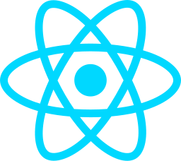

  

# 
&lt;WELCOME TO SNIPPETLABS/&gt;

## ABOUT US

At snippetlabs, we are passionate about building high-quality software solutions with a strong emphasis on best practices and innovation. Our team of expert engineers and developers is committed to delivering clean, efficient, and maintainable code while fostering a positive and collaborative work environment. With a focus on modern technologies and cutting-edge methodologies, we strive to create scalable and robust applications that drive success.

#### WHY CHOOSE US ?

- `QUALITY CODE` – We adhere to industry-leading coding standards to ensure reliability and maintainability.
- `BEST PRACTICES` – Our development approach follows proven methodologies, including Agile, TDD, and CI/CD.
- `INNOVATION & EFFICIENCY` – We leverage the latest technologies to build scalable and high-performance solutions.
- `COLLABORATIVE WORK CULTURES` – A strong emphasis on teamwork, knowledge sharing, and continuous learning.
- `SOLUTION CENTRIC APPROACH` – We prioritize our clients' needs and tailor solutions to their unique business challenges.

At snippetlabs, we believe that great software starts with a great team. Join us as we push the boundaries of technology and create solutions that make an impact!

## OUR TECHNOLOGY STACK

<table align="center" border="1">
  <tr>
    <td align="center"> </td>
    <td align="center"> </td>
    <td align="center"> </td>
    <td align="center"> </td>
    <td align="center"> </td>
    <td align="center"> </td> 
    <td align="center"> </td>
    <td align="center"> </td>
    <td align="center"> </td>
    <td align="center"> </td>
    <td align="center"> </td>
    <td align="center"> </td>
    <td align="center"> </td>
    <td align="center"> </td>
  </tr>
</table>

## 
 TOGETHER WE STAND 

<table align="center" border="1">
  <tr>
    <td> </td>
    <td>  </td>
  </tr>
</table>

## 
 LET'S WORK TOGETHER

WE ARE ALWAYS UP TO SOMETHING INTERESTING AND EXCITING,
<u>JUST CLICK THE ICONS & LET'S COLLABORATE</u>

 
<table align="center" border="1">
  <tr>
    <td>   
    <a href="mailto:snippetlabsbusiness@gmail.com"> 
     
    </td>
  </a>
  </tr>
</table>

  

